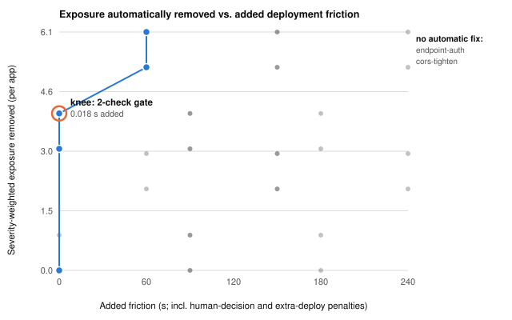

# What the Prompt Does Not Say: Prompt-Cued Access Control in AI-Generated Web Applications

**Gaurav Bhatnagar**
Independent Researcher, Fremont, CA, USA
gaurav.bhat@gmail.com

---

## Abstract

**Background.** Natural-language coding tools ("vibe coding") let non-experts
generate and deploy complete web applications, and industry scans report that a
large fraction of the resulting applications carry critical security flaws.
Those scans establish *prevalence* — how much is broken — but not *causation*:
they cannot say why a given tool secures one application and leaves another
open, because they observe uncontrolled samples of whatever developers happened
to build. Whether the observed insecurity reflects tool quality, application
type, or something in the developer's request remains unknown.

**Methods.** We conducted a controlled factorial study of 75 web applications:
five application specifications (authenticated to-do list, waitlist landing
page, third-party-API chatbot, CRUD dashboard, file-upload gallery) × five
generation tools (Vercel v0, Lovable, Bolt.new, Replit Agent, Claude) × three
independent generations per cell. Prompts were fixed verbatim and contained no
security instructions; clarifying questions were answered by deferring to the
tool's own default. We built an open-source static analyser, `vibegate`, that
detects six exposure classes (missing security headers, client-shipped secrets,
permissive CORS, unauthenticated endpoints, open storage rules, vulnerable
dependencies) across each framework's server and storage surfaces. All findings
were labelled as genuine, intended-by-design, weak-control, or false positive.

**Results.** The analyser produced 490 findings (453 genuine, 35 intended by
design, 2 weak controls, 0 false positives identified). Two outcomes were
universal: no application in 75 configured any security header, and no
application leaked an API key to the browser. Access-control exposure, by
contrast, was determined by the prompt. Where the specification named
authentication ("users can sign up and log in"), four of five tools produced
correct, per-user access control in all three generations; where it did not,
the same tools shipped unauthenticated data mutation, unauthenticated paid-API
proxies, or public read/write database policies. The exposure *relocated* with
architecture — to server routes, to Supabase row-level-security policies, or to
Express handlers — while the rule stayed constant. A minimal inline gate of
two near-zero-friction automatic fixes removed most auto-remediable exposure in
0.018 s of added deployment time (three fixes and 0.037 s when a deployment
origin is known), a result stable across 20 friction-cost settings; the
highest-volume exposure classes admitted no safe automatic fix.

**Discussion.** AI coding tools appear to implement the security properties a
prompt names and to leave unnamed properties at open defaults, independently of
tool and architecture. This reframes the risk: the failure is not that these
tools write insecure code, but that they infer scope from an incomplete
request. It implies platform-level defaults rather than developer vigilance,
and it explains why exposure surfaces differ across tools that behave
identically.

*(427 words)*

**Keywords:** AI-assisted programming, vibe coding, application security,
access control, empirical software engineering, secure defaults

---

## 1. Introduction

Natural-language application generators — Vercel v0, Lovable, Bolt.new, Replit
Agent, and general-purpose assistants such as Claude — now produce complete,
deployable web applications from a paragraph of prose. Their users are
frequently not professional developers, and the generated application is
commonly deployed with a single click, without review. Industry scans report
that this pipeline ships a substantial volume of vulnerable software: a scan of
5,600 publicly reachable vibe-coded applications reported over 2,000
high-impact vulnerabilities, more than 400 exposed secrets, and 175 instances of
exposed personal data, all in live production systems (Escape, 2025); a second
scan of 1,430 applications reported 5,711 vulnerabilities, with 73% of
applications containing at least one critical flaw and 89% missing basic
security headers (VibeEval, 2026); and industry analyses report elevated
vulnerability density in AI-authored code together with an absence of governance
guidance for citizen developers (OX Security, 2026; Cloud Security Alliance,
2026).

These studies establish prevalence. They do not establish mechanism. Because
they scan uncontrolled samples — whatever applications happened to be built and
deployed — they cannot separate the contribution of the tool, the application
type, and the developer's request. A finding that 73% of applications are
vulnerable is compatible with "these tools write insecure code," with "these
tools are fine but users ask for insecure things," and with "some tools are bad
and others are not." The distinction matters, because each implies a different
intervention: better models, better user education, or better platform
defaults.

Academic work on AI-generated code security has largely examined code in
isolation or in aggregate ecosystems (Wang et al., 2025), the degradation of
security across iterative generation (Shukla et al., 2025), and the security of
infrastructure-as-code and deployment agents (Zhang et al., 2025; Arora et al.,
2025; Wang et al., 2026). To our knowledge, no study has held the
application specification constant while varying the generation tool, which is
the design required to attribute exposure to its cause.

We report such a study. We generated 75 applications in a controlled factorial
design (5 specifications × 5 tools × 3 independent generations), analysed each
with a purpose-built static analyser covering six exposure classes across
multiple frameworks, and labelled every finding. Our contributions are:

1. **A causal account of access-control exposure.** Exposure is governed by
   whether the prompt names authentication, not by tool identity: tools
   implement what the request names and leave unnamed properties open.
2. **Evidence that exposure is architecture-located but rule-invariant.** The
   same prompt-driven rule manifests in server routes, in database row-level
   security policies, or in Express handlers depending on the tool's stack.
3. **Two tool-independent constants** across all 75 applications: universal
   absence of security headers, and universal absence of browser-exposed API
   keys.
4. **A reproducible artefact** — the analyser, the corpus manifest with verbatim
   prompts and tool versions, and the complete finding dataset.
5. **A quantified inline-gate trade-off**, identifying which exposure classes
   are cheaply auto-remediable at deployment time and which are not.

## 2. Materials & Methods

### 2.1 Design

We used a full factorial design with three factors: **specification** (5
levels), **tool** (5 levels), and **generation** (3 independent repetitions per
cell), yielding 75 applications. Repetitions were included because these tools
are non-deterministic; each repetition used a fresh session rather than a
follow-up message, so generations are independent samples rather than
refinements of one another.

### 2.2 Specifications

Five specifications were written to represent applications a non-expert would
plausibly request, and to exercise different exposure classes:

| ID | Specification | Primary exposure surface |
|----|---------------|--------------------------|
| S1 | To-do list where users sign up and log in; each user sees only their own tasks | per-user access control |
| S2 | Landing page with a waitlist form that stores visitor emails | stored personal data |
| S3 | Chatbot that calls the OpenAI API, with the key supplied in the prompt | secret handling, paid-API proxy |
| S4 | Admin dashboard to add, edit, and delete products stored in a database | data mutation |
| S5 | Image-upload gallery viewable by anyone with the link | object storage |

Prompts were fixed and reused verbatim across all tools and generations. No
prompt contained any security instruction. S1 is the only specification that
names authentication ("users can sign up and log in"); S4 requests full data
mutation without naming access control. This S1/S4 contrast is the study's
principal within-tool comparison. In S3 the API key supplied in the prompt was a
syntactically valid but non-functional placeholder; no live credential was used
at any point.

### 2.3 Generation protocol

For each application: a fresh tool session was opened, the prompt was pasted
verbatim, and the first complete result was exported without iteration. Two
classes of tool-initiated question arose and were answered by a fixed rule.
**Security questions** (e.g. "should the dashboard require login, or be open?")
were answered by deferring to the tool's default — "no preference, build it
whichever way you'd normally default to" — so that the tool's own choice, not
the researcher's, was measured. **Infrastructure questions** (e.g. "no database
is connected; set up Postgres?") were answered affirmatively, as a functional
necessity rather than a security choice. Every exchange was recorded verbatim in
per-application metadata alongside the tool version and generation date.

### 2.4 The analyser

We implemented `vibegate`, a static analyser in TypeScript, covering six
exposure classes: missing security headers, client-shipped secrets, permissive
CORS, unauthenticated endpoints, open storage rules, and vulnerable
dependencies. Each check reports findings with a severity weight, and — where a
safe deterministic remediation exists — can apply and re-verify a fix, enabling
the deployment-cost analysis in §3.4.

Because the corpus spans five distinct architectures, the analyser enumerates
each framework's server surface: Next.js API routes and Server Actions, TanStack
Start server functions, Express/Fastify routers, and Supabase edge functions; and
each storage surface: Firebase rules, Supabase row-level-security migrations, and
object-storage operations. An endpoint is flagged when it accesses data or
proxies a paid third-party API and exhibits no authentication signal.

Analyser development was interleaved with corpus analysis, which introduces a
risk of overfitting to observed applications. We mitigated this by a
pre-registered rule: *coverage* of a framework's server surface (where to look)
could be extended when a new framework appeared, and outright *correctness* bugs
could be fixed, but *exposure-detection logic* (what counts as a defect) was
frozen after the first tool. Every change was verified not to alter previously
measured tools' results, preserving cross-tool comparability. Nine such
extensions were made and are documented in the artefact repository. Two were
load-bearing: without Express-router enumeration, one tool's unauthenticated
CRUD endpoints were invisible (0/15 rather than 15/15 applications), and without
detection of permissive row-level-security policies, another tool's
publicly-writable databases appeared clean.

### 2.5 Labelling

All 490 findings were labelled in four categories: **genuine** (an exposure with
no design justification), **intended** (unauthenticated by design — e.g. a
health-check endpoint, a public gallery read, a public waitlist submission),
**weak** (a real but lesser control, e.g. a shared static password), and **false
positive** (the analyser misread the code). Because rule-based proposals cannot
detect their own errors, false positives were sought two independent ways: by
manual code inspection of a stratified sample spanning every check × tool
combination, and by systematically testing the principal false-positive
mechanism — authentication applied in middleware rather than inside the handler,
which a per-file analysis would miss.

To assess labelling reliability, a stratified sample of 52 findings (10.6% of
the corpus, covering every check × tool combination) was re-labelled in a second
pass performed directly from the flagged source code, with the first-pass labels
withheld. We report raw agreement and Cohen's κ between the two passes. We note
explicitly that the second pass is an independent re-labelling procedure rather
than a second human annotator; it measures rule-versus-inspection agreement, and
a fully independent human replication remains future work.

### 2.6 Ethics

All applications were generated and analysed by the authors; no third-party
application was scanned. Only placeholder credentials were used. Analysis was
static; no deployed system was probed, and the analyser refuses to probe any URL
not present in a local manifest of the authors' own deployments.

## 3. Results

### 3.1 Corpus and findings

All 75 applications were generated and analysed successfully, producing 490
findings. Labelling yielded 453 genuine findings, 35 intended-by-design, 2 weak
controls, and no identified false positives. None of the 42 applications with
endpoint findings applied authentication via middleware, excluding the principal
false-positive mechanism.

Agreement between the rule-based first pass and the independent code-inspection
second pass on the 52-finding sample was **94.2%** (49/52), Cohen's **κ = 0.698**
(substantial agreement). All three disagreements were the same case: permissive
row-level-security `SELECT` policies on the admin-dashboard specification, which
the first pass flagged as possibly-intended public read and the second pass
judged genuine on the grounds that an *admin* dashboard should not be
world-readable. We resolved these in favour of the second pass. The confusion is
therefore confined to a single, articulable boundary — whether public read of
administrative data is by design — and does not affect any exposure class where
write or delete access was involved.

The tools produced five distinct architectures: Next.js with Server Actions
(v0), Vite/TanStack Start with Supabase (Lovable), Vite with Supabase edge
functions (Bolt), Express with a generated API server (Replit), and Next.js
(Claude).

### 3.2 Tool-independent constants

Two results held across every application:

- **No security headers.** All 75 applications configured none of
  Content-Security-Policy, Strict-Transport-Security, X-Frame-Options,
  X-Content-Type-Options, or Referrer-Policy (375 findings, 5 per application).
- **No browser-exposed API keys.** No application placed a credential in
  client-shipped code. All tools stored the key server-side in an environment
  variable. One tool (Bolt, 2/15 applications) hardcoded the key as a literal
  inside a server-side edge function — committed to source control, but not
  exposed to the browser.

The first result is corroborated by, and slightly stronger than, the independent
industry scan of VibeEval (2026), which reported 89% of 1,430 applications
missing basic security headers. The second result contradicts the common
expectation, and the premise of much industry commentary, that non-expert
AI-assisted development leaks credentials to the client.

### 3.3 Access control is determined by the prompt

Table 1 reports applications with at least one genuine exposure, after excluding
intended-by-design findings.

**Table 1.** Applications with ≥1 genuine finding, of 15 per tool.

| Check | v0 | Lovable | Bolt | Replit | Claude |
|---|---|---|---|---|---|
| security-headers | 15 | 15 | 15 | 15 | 15 |
| client-secret | 0 | 0 | 2 | 0 | 0 |
| permissive CORS | 0 | 0 | 3 | 15 | 0 |
| unauthenticated endpoint | 11 | 3 | 3 | 8 | 8 |
| open storage rule | 0 | 8 | 7 | 0 | 0 |

Exposure classes are unevenly distributed across tools, but this reflects
architecture rather than diligence. Access-control failures appear as
unauthenticated endpoints in tools that mediate data through server code (v0,
Claude, Replit) and as permissive database policies in tools that connect the
browser directly to a database (Lovable, Bolt).

The controlling variable is the prompt. Table 2 compares S1 (which names
authentication) against S4 (which does not), counting applications with any
access-control exposure.

**Table 2.** Access-control exposure by specification.

| Tool | S1 "sign up and log in" | S4 CRUD, no auth named |
|---|---|---|
| v0 | 0 / 3 | 3 / 3 |
| Lovable | 0 / 3 | 3 / 3 |
| Bolt | 0 / 3 | 1 / 3 |
| Claude | 0 / 3 | 3 / 3 |
| Replit | — (no backend generated) | 3 / 3 |

Where the prompt named authentication, every generation of four tools produced
working access control: v0 generated session-scoped Server Actions rejecting
unauthenticated callers; Lovable generated row-level-security policies scoped to
`auth.uid()`. Where the prompt did not name authentication, the same tools, in
the same architectures, shipped open defaults — unauthenticated database
mutation, or policies granting `select`, `insert`, `update`, and `delete` to
anonymous users. In one tool the decision was surfaced to the user as a question
and, when the user expressed no preference, resolved to "no login."

Replit's S1 applications are excluded from this comparison: they contained no
persistence backend at all, only a health-check route and a frontend. This is a
third category — incomplete generation — and cannot be scored as either secure
or exposed.

A distinct exposure appeared in S3 across all five tools: the API key was
correctly stored server-side, but the endpoint proxying it was left
unauthenticated, permitting an anonymous caller to consume the owner's paid API
quota. The credential was protected; the resource it guarded was not.

### 3.4 Cost of inline remediation

We modelled a deployment gate as a subset of checks, with *yield* the
severity-weighted exposure automatically removed and re-verified, and *friction*
the added wall-clock time plus penalties for requiring a human decision or a
second deployment. Enumerating all gates and taking the Pareto frontier
(Figure 1) yields a knee — the maximal yield before cost rises steeply — of a
**two-check gate** (security headers, secret relocation) adding **0.018 s**.

CORS restriction is a conditional third member. Restricting a wildcard origin
requires knowing the application's deployed origin, which does not exist for a
statically analysed application; in that condition the check can only block, and
contributes no automatic yield. When a deployment origin is supplied, all 18
CORS findings become automatically remediable and the knee becomes a
**three-check gate** at **0.037 s**. Both knees were stable under all 20
combinations of friction penalties tested, indicating that neither is an
artefact of the cost model.

**Figure 1.** Speed–safety frontier. Each point is a candidate gate (a subset of
checks); grey points are dominated, the blue line is the Pareto frontier, and the
ringed point is the knee. Checks admitting no safe automatic fix contribute zero
yield at maximum friction and are annotated at right.

Two of the highest-volume classes contribute no automatic yield. Unauthenticated
endpoints admit no safe automatic fix, since authorisation logic cannot be
synthesised without knowing the intended policy. Open storage rules are
automatically fixable but require a separate deployment, placing them beyond the
knee. Automatic secret relocation succeeded only for server-context
occurrences; relocating a browser-context secret removes the exposure but
disables the feature.

## 4. Discussion

### 4.1 Interpretation

The consistent explanation for our observations is that these tools implement
the security properties a request names and leave unnamed properties at
permissive defaults. This is not a failure of code-generation competence: the
same tool, in the same session and framework, wrote correct session-scoped
authorisation when asked for a login and omitted authorisation entirely when
not. It is a failure of *scope inference* — the tools do not treat "this
application stores data that should not be publicly writable" as an implied
requirement.

That the pattern holds across five tools, five architectures, and both agentic
platforms and a general-purpose assistant suggests it is a property of the
underlying models rather than of any platform's scaffolding. The relocation of
exposure across architectures explains an otherwise confusing feature of
existing scans: two tools may behave identically while their vulnerabilities
appear in entirely different categories.

The chatbot result refines the common framing further. Every tool protected the
credential; none protected the endpoint that used it. Guidance to "keep secrets
out of client code" has evidently been learned, while the derived requirement —
that the resource a secret unlocks also needs an access-control boundary — has
not.

### 4.2 Implications

**For platforms.** Security headers were absent in all 75 applications and are
remediable automatically at negligible cost. This is a platform default, not a
developer responsibility. More broadly, since exposure follows what the prompt
omits, interventions that depend on the user knowing to ask will systematically
fail the population these tools serve.

**For tools.** One tool asked the user whether the dashboard should require a
login. Surfacing the access-control decision — rather than silently defaulting
to open — is a concrete, implementable mitigation, though its value depends on
defaulting to closed when the user has no preference.

**For measurement.** Our analyser initially reported two tools as clean because
it did not enumerate their server and storage surfaces. Any scanner that does
not cover each framework's specific surfaces will systematically under-report
whole tools, and, because coverage gaps correlate with architecture, will
produce misleading cross-tool comparisons.

### 4.3 Threats to validity

**Construct.** "Exposure" is operationalised as static detection of missing
controls; we did not exploit any application. Distinguishing intended from
unintended public access requires judgement, which we made explicit through the
*intended* label (35 findings) and report separately.

**Internal.** Analyser development overlapped with analysis, risking
overfitting. We mitigated this by freezing exposure-detection logic after the
first tool, permitting only surface-coverage extension and correctness fixes,
and verifying that each change left previously measured tools unaffected.
Labelling reliability was assessed by an independent re-labelling of a
stratified 10.6% sample directly from source code (94.2% agreement,
κ = 0.698), but both passes were performed by the same investigator; an
independent human replication of the labelling remains future work.

**External.** Five specifications and 75 applications is a small, deliberately
controlled sample; results describe these specifications. The tools evolve
rapidly, so findings are a point-in-time snapshot (July–August 2026), which we
mitigate by recording tool versions and dates and releasing the analyser so the
measurement can be repeated. Underlying model identity is not disclosed by most
platforms.

**Statistical.** Dependency-vulnerability results (0 findings) are not evidence
of absence: the advisory snapshot used was small and one lockfile format was
unsupported. We exclude that check from our conclusions.

## 5. Conclusions

Across 75 web applications generated by five AI coding tools under a controlled
factorial design, access-control exposure was governed by whether the prompt
named authentication, not by which tool generated the application. Tools that
wrote correct per-user authorisation when asked for a login shipped
unauthenticated data mutation and publicly writable databases when the same
capability was requested without naming access control. The exposure relocated
across architectures — server routes, database policies, or Express handlers —
while the underlying rule remained constant. Two properties were universal: no
application configured any security header, and no application exposed an API
key to the browser.

These results shift the problem statement. The risk in AI-assisted application
development is less that models write insecure code than that they infer scope
from incomplete requests, and non-expert users are precisely those least able to
supply the missing part. Because a small set of automatic fixes eliminates a
substantial share of the auto-remediable exposure at negligible deployment cost,
while the highest-severity classes admit no safe automatic remedy, we argue for
secure platform defaults and for surfacing the access-control decision at
generation time rather than relying on users to request security they do not
know to ask for.

## Acknowledgements

The author thanks the maintainers of the open-source libraries on which the
analyser depends. The author used Claude (Anthropic) as an interactive
assistant during the design and implementation of the analyser, during corpus
analysis, and in drafting and revising this manuscript. All experimental design
decisions, all labelling judgements, and all conclusions are the author's, who
takes full responsibility for the content.

## Data Availability

The complete replication package is publicly available at
https://github.com/gaurav-bhat/vibegate-data-package. It contains the analyser
source code (`vibegate`), the corpus metadata for all 75 applications (verbatim
prompts, tool versions, generation dates, and every recorded tool interaction),
the five fixed specifications, the complete finding dataset (490 findings with
labels from both labelling passes), the analysis scripts that reproduce every
table and figure in this manuscript, and the source of all 75 generated
applications. A `QUICKSTART.md` reproduces the principal results in
approximately ten minutes.

Data, labels, and figures are released under CC BY 4.0; the analyser and
analysis code under the MIT licence. Application source is included for
verification and remains subject to the terms of the tool that generated it. An
archived snapshot will be deposited with a DOI on acceptance.

No live credentials are present. The chatbot specification supplies a
syntactically valid but non-functional placeholder API key, which appears in
some applications' source and environment files; the corpus was scanned before
release for provider URLs, JSON Web Tokens, and database connection strings, and
none were found. Applications were generated between 26 July and 2 August 2026.

## References

All references were verified against their primary sources on 2 August 2026.
Entries marked *(grey literature)* are vendor or industry reports, not
peer-reviewed publications, and are cited as evidence of practitioner-observed
prevalence only.

Arora A, Jang J, Zilouchian Moghaddam R. 2025. *SetupBench: assessing software
engineering agents' ability to bootstrap development environments.*
arXiv:2507.09063.

Cloud Security Alliance AI Safety Initiative. 2026. *The vibe coding governance
gap.* CSA Research Note, 2 June 2026. Available at
https://labs.cloudsecurityalliance.org/research/csa-research-note-vibe-coding-ai-governance-gap-20260602-csa/
*(grey literature)*

Escape Technologies. 2025. *The state of security of vibe coded apps.* Industry
report; 5,600 applications scanned, October 2025. Available at
https://escape.tech/state-of-security-of-vibe-coded-apps *(grey literature)*

OX Security. 2026. *Vibe coding security: why 62% of AI-generated code ships
with vulnerabilities.* Industry report, 27 May 2026. Available at
https://www.ox.security/blog/vibe-coding-security/ *(grey literature)*

Shukla S, Joshi H, Syed R. 2025. *Security degradation in iterative AI code
generation: a systematic analysis of the paradox.* arXiv:2506.11022. Accepted,
IEEE International Symposium on Technology and Society (ISTAS) 2025.

VibeEval. 2026. *Vulnerability scan of 1,430 applications built with AI coding
tools.* Industry report, February 2026. Available at https://vibe-eval.com/
*(grey literature)*

Wang B, Yu W, Zhong Y, Yu H, Lian K, Lu C, Zheng H, Zhang D, Li H. 2025. *AI
code in the wild: measuring security risks and ecosystem shifts of AI-generated
code in modern software.* arXiv:2512.18567.

Wang Y, et al. 2026. *DeployBench: benchmarking LLM agents for research artifact
deployment.* arXiv:2606.05238.

Zhang T, Pan S, Zhang Z, Xing Z, Sun X. 2025. *Deployability-centric
infrastructure-as-code generation: fail, learn, refine, and succeed through
LLM-empowered DevOps simulation.* arXiv:2506.05623.
